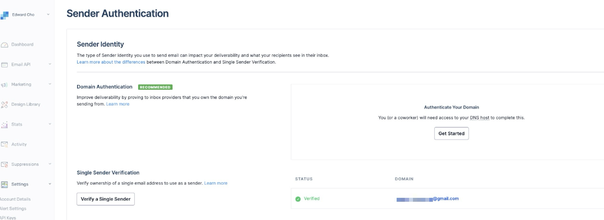
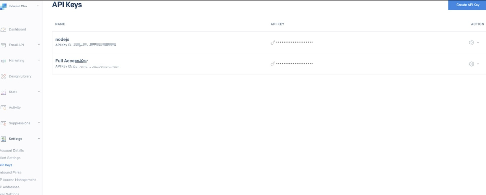
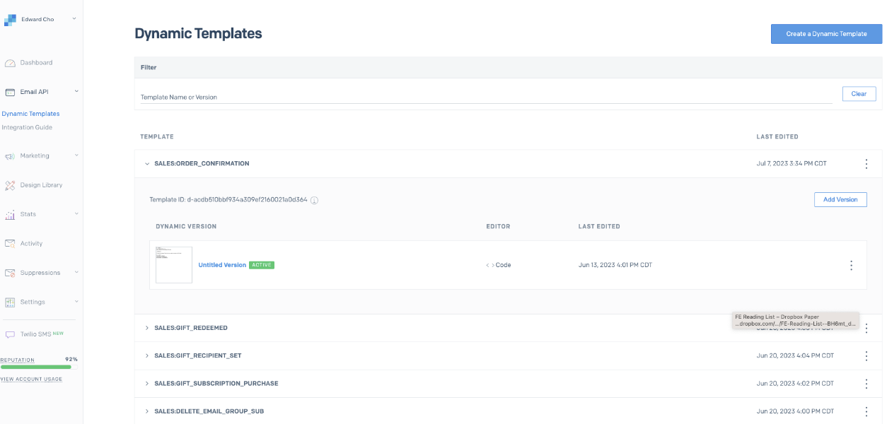
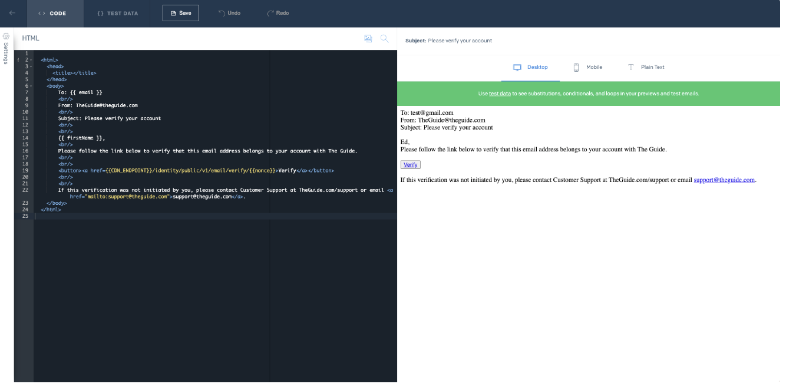
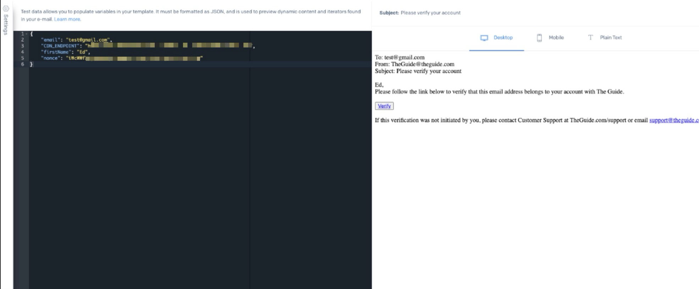

Example code is provided by a community of developers. They are intended to help you get started more quickly, but are not guaranteed to cover all scenarios nor are they supported by Arc XP.

> These examples are licensed under the [MIT license](https://mit-license.org/): THE SOFTWARE IS PROVIDED "AS IS", WITHOUT WARRANTY OF ANY KIND, EXPRESS OR IMPLIED, INCLUDING BUT NOT LIMITED TO THE WARRANTIES OF MERCHANTABILITY, FITNESS FOR A PARTICULAR PURPOSE AND NONINFRINGEMENT. IN NO EVENT SHALL THE AUTHORS OR COPYRIGHT HOLDERS BE LIABLE FOR ANY CLAIM, DAMAGES OR OTHER LIABILITY, WHETHER IN AN ACTION OF CONTRACT, TORT OR OTHERWISE, ARISING FROM, OUT OF OR IN CONNECTION WITH THE SOFTWARE OR THE USE OR OTHER DEALINGS IN THE SOFTWARE.

Reiterated from license above, all code in this example is free to use, and as such, there is NO WARRANTY, SLA or SUPPORT for these examples.

----

Community Examples are demo integrations and implementations designed to assist customer developers in solving common problems efficiently. These examples provide practical, working examples that developers can use as templates or references when building their applications. Examples are designed to be starting points and may not cover all scenarios. Customers must have at least access to one developer to manage code updates as all software requires updates over time.

## Background

Many of our clients use ESP to effectively manage and execute email marketing campaigns, resulting in improved deliverability, engagement, and ultimately business growth. However, it may be a bit cumbersome for clients currently to manually connect Arc Subscriptions WebSocket events to their ESP. Today we will be showing how to create integration between Subscriptions and SendGrid using IFX Node.js implementations. This will allow clients to send transactional emails triggered by the Subscription events. Many of our clients may already have an ESP of choice for marketing purposes and this integration can be also extended to easily send emails with the existing ESP. 

Arc XP's Subscriptions make setting up your email service provider (ESP) quick and painless with our extendable Connector. The Connector utilized IFX to create an integration between Subscriptions WebSocket events and SendGrid. Want to continue using your preferred ESP, just extend this Connector using this guide. You will be up and running quickly and then can move on to tailoring your marketing and transactional emails for your business.

## Prerequisites

This assumes you have set up an IFX integration locally. You can find the guides <a href="https://dev.arcxp.com/integrations/ifx-list-of-guides-resources/" target="_blank">here</a>.

## Subscribe to Events

Below is an example payload <a href="https://dev.arcxp.com/integrations/events/ifx-events/#subscribing-to-an-event/" target="_blank">subscribing to</a> the `commerce:verify_email` event:

`POST /ifx/api/v1/admin/events/subscriptions`
  ```json
    {
      "eventName": "commerce:verify_email",
      "enabled": true,
      "integrationName": "my-integration-name"
    }
  ```

This should be done for each event that you'd like your integration to listen to.

## Modify the Example Code

* Download and unzip <a href="https://github.com/arcxp/arcxp-subscriptions_sendgrid_example/blob/main/dist.zip" target="_blank">https://github.com/arcxp/arcxp-subscriptions_sendgrid_example/blob/main/dist.zip</a>

* Copy the code in the `src` to the newly created repository. If you do not have access to this code, please submit an ACS request.

* `@sendgrid/mail` needs to be installed on top of what is already on the template code

* More details on running the app locally can be found <a href="https://dev.arcxp.com/integrations/how-to-guides/locally-simulate-http-requests/" target="_blank">here</a>

* For secrets and sensitive information such as the SendGrid API key, you should store these values by following <a href="https://dev.arcxp.com/integrations/secrets/create-a-secure-secret-and-use-within-your-integration/" target="_blank">this guide</a>

* For non-sensitive information, such as `CDN_ENDPOINT`, `EMAIL_SENDER`, and `WEB_SITE_URL`, these can be stored in the respective environments (`.env.development`, `.env.sandbox`, and `.env.production`)

* You will need to update `templateId` used in each email handler with the values from dynamic templates from your SendGrid account as well as variables in the `.env` files


```javascript
// src/eventsHandlers/verifyEmailHandler.js

const sendEmail = require('../sendEmail');

const verifyEmailHandler = async (event) => {
    const msg = {
      to: event?.body?.email,
      from: process.env.EMAIL_SENDER,
      subject: 'Please verify your account',
      // Please update templateId with correct value
      templateId: 'd-db2624673d4c4d989474ecacd1a626b3',
      dynamic_template_data: {
        firstName: event?.body?.firstName,
        CDN_ENDPOINT: process.env.CDN_ENDPOINT,
        email: event?.body?.email,
        nonce: event?.body?.nonce
      }
    }

    await sendEmail(msg);
}

module.exports = verifyEmailHandler;
```

`eventsRouter.json` determines which event gets routed to a specific handler. For example, when `commerce:verify_email` event is triggered, logic inside the `verifyEmailHandler` will be executed.

```json
// src/eventsRouter.json
{
  "verifyEmailHandler": ["commerce:verify_email"],
  "emailVerifiedHandler": ["commerce:email_verified"],
  "userSignupHandler": ["commerce:user_sign_up"],
  "usersigninaddedHandler": ["commerce:user_sign_in_added"],
  "passwordresetrequestHandler": ["commerce:password_reset_request"] ,
  "passwordresetHandler": ["commerce:password_reset"],
  "magiclinksendHandler": ["commerce:magic_link_send"],
  "orderconfirmationHandler": [
    "commerce:finalize_payment",
    "commerce:order_confirmation"
  ]
}
```

The events emitted by Arc Subscriptions include predefined data on these events but if you want some custom data, you can call developer API from the event handler to get the data and use those in the dynamic email template. For example, if the `firstName` was not provided, a developer can call a developer API with a PAT and use the result to populate the dynamic template.

```js
// src/eventsHandlers/verifyEmailHandler.js
const axios = require( 'axios');
const sendEmail = require('../sendEmail');

const verifyEmailHandler = async (event) => {

  const url = `${process.env.API_ENDPOINT}identity/api/v1/profile/${event?.body?.uuid}`
  const options = {
    headers: {
      'Content-Type': 'application/json',
      'Authorization': `Bearer ${process.env.ARC_PAT}`
    }
  }

  const data = await axios get(url, options)
    .then(res => res.data)
    .catch (e => console.error(e));

  const msg = {
    to: event?.body?.email,
    from: process.env.EMAIL_SENDER,
    subject: 'Please verify your account',
    templateId: 'd-db2624673d4c4d989474ecacd1a626b3',
    dynamic_template_data: {
      firstName: data?.firstName,
      CDN_ENDPOINT: process.env.CDN_ENDPOINT,
      email: event?.body?.email,
      nonce: event?.body?.nonce
    }
  }

  await sendEmail(msg);

}

module.exports = verifyEmailHandler;
```


## Set up a SendGrid account

Use <a href="https://docs.sendgrid.com/for-developers/sending-email/api-getting-started" target="_blank">this link</a> to get started with SendGrid.

> Note: For this implementation, we've created an account and verified the account as a single sender verification.



Create an API key under the account.



Create dynamic templates to be used with different events



You'll need template ids later in the guide.



The dynamic template uses Handlebars. `{{}}` can be used to insert variables and test data can be inserted to preview the email



## Bundle, Deploy, Promote IFX Integration

Follow <a href="https://dev.arcxp.com/integrations/bundle-deployment-workflow/" target="_blank">this guide</a> to bundle, deploy and promote your integration.

## Debugging and Testing

* Test your code locally by running `npm run localTestingServer` and then sending POST requests to `http://127.0.0.1:8080/ifx/local/invoke` to verify that your handlers are behaving in the expected way.
> See: <a href="https://dev.arcxp.com/integrations/how-to-guides/locally-simulate-http-requests/" target="_blank">Locally Simulate HTTP Requests</a>

* Keeping a WebSocket connection live while testing events can be helpful in verifying that the events are being triggered. <a href="https://dev.arcxp.com/subscriptions/identity/build/ifx-email-service-provider-integration-and-websocket-events/#how-to-listen-to-websocket-events" target="_blank">How to Listen to Arc XP Subscriptions Events Using WebSockets</a>

* Use logs to help with testing and debugging. <a href="https://dev.arcxp.com/integrations/logs-metrics/integration-logs-ui/" target="_blank">How to Use Integration Logs with IFX</a>

* Refer to the [FAQ](https://dev.arcxp.com/integrations/ifx-faqs-troubleshooting-best-practices/) document for further debugging and testing information

